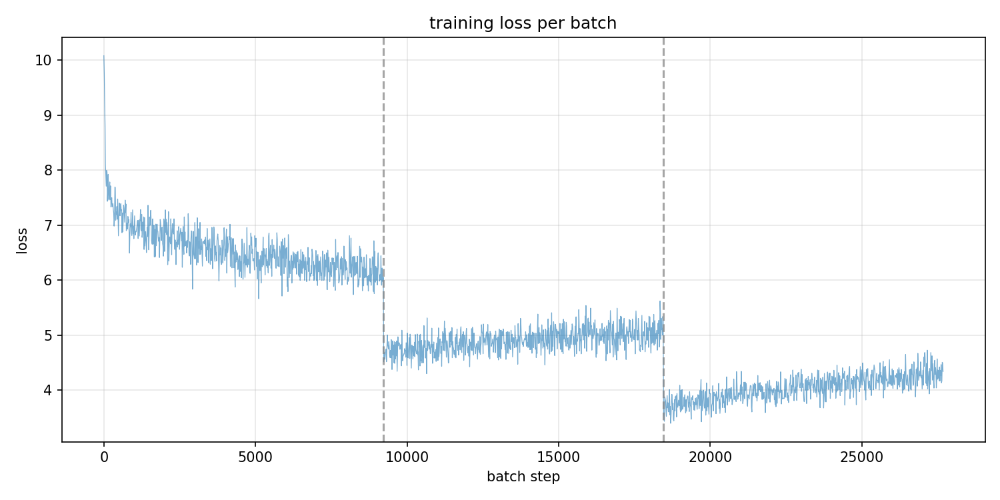
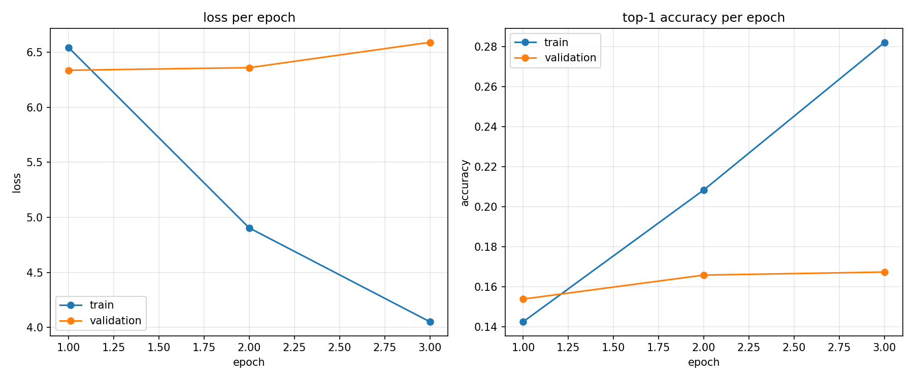

# Neural Probabilistic Language Model

A from-scratch implementation of the classic **Neural Probabilistic Language Model (NPLM)** from Bengio et al. (2003), *"A Neural Probabilistic Language Model"* (JMLR). The model learns to predict the next token given a fixed window of previous tokens, using a feed-forward network with word embeddings.

## How it works

Given a window of `N` previous tokens, the model:

1. Looks up a dense **embedding** for each token (`nn.Embedding`)
2. Concatenates the embeddings into one flat vector
3. Passes it through hidden linear layers with a configurable activation (ReLU or tanh)
4. Projects to a score per vocabulary word
5. Optionally adds a **direct connection** from the concatenated embeddings to the output (Bengio's original design found this helped)
6. Applies **softmax** to get a probability distribution over the next token

The model is trained with cross-entropy loss: maximize the probability of the actual next token in the training corpus.

```
[emb t-9] [emb t-8] ... [emb t-1]
        \      |      /
         concatenated vector
               |
          [hidden layers]
               |
          [output layer + direct connections]
               |
            softmax
               |
      P(next token | context)
```

## Repository layout

| File | Description |
| --- | --- |
| `model.py` | The `NeuralModel` class (embedding → hidden layers → output, optional direct connections, configurable depth/activation) |
| `train.py` | Full training pipeline: data download, BPE tokenizer training, dataset build, training loop, evaluation, plotting, text generation |
| `tokenizer2.json` / `tokenizer103.json` | Trained byte-level BPE tokenizers (generated on first run, one per dataset) |
| `model.pt` | Saved model weights (generated after training) |
| `artifacts/` | Loss/accuracy plots saved after training (`train_loss.png`, `loss_accuracy.png`) |

## Requirements

- Python 3.8+
- `torch`
- `tokenizers`
- `datasets` (v1)
- `matplotlib`

Install:

```bash
pip install torch tokenizers datasets matplotlib
```

## Dataset

**WikiText-2** (`wikitext-2-raw-v1`) by default — a ~2M-token benchmark corpus of Wikipedia articles — or **WikiText-103** (`wikitext-103-raw-v1`) — ~103M tokens. Selected with `--dataset`:

```bash
python train.py --dataset 2      # wikitext-2 (default)
python train.py --dataset 103    # wikitext-103
```

Scripts download the raw train/validation splits from Hugging Face via the `datasets` library on first run.

## Tokenizer

A **byte-level BPE** tokenizer is trained on the chosen dataset's train split:

- Vocabulary size: **20,000** (+ 4 special tokens: `<unk>`, `<pad>`, `<bos>`, `<eos>`)
- `min_frequency=2`
- Byte-level, so any text can be encoded, with no out-of-vocabulary characters

Each dataset gets its own tokenizer file (`tokenizer2.json` / `tokenizer103.json`), saved after training and reused on later runs (training is skipped if the file already exists).

## Model configuration

Defaults in `train.py`:

| Hyperparameter | Value |
| --- | --- |
| `EMB_SIZE` (embedding dim) | 128 |
| `CONTEXT` (window size) | 10 |
| `HIDDEN` (hidden units) | 256 |
| `HID_LAYERS` (hidden layers) | 1 |
| `ACTIVATION` | relu (tanh also supported) |
| `DROPOUT` | 0.2 (applied to embeddings and hidden layers) |
| `BATCH_SIZE` | 256 |
| `LR` (Adam) | 3e-4 |
| `EPOCHS` | 3 |
| Direct connections | enabled |

## Training

```bash
# Full run on wikitext-2 (default)
python train.py

# wikitext-103
python train.py --dataset 103

# Quick smoke test (first 50k tokens per split, 1 epoch)
python train.py --limit 50000 --epochs 1

# Run on CPU (e.g. GPU driver incompatibility)
python train.py --device cpu
```

The training input is built by sliding a window of `CONTEXT` tokens over the tokenized corpus: every context window predicts the token that follows it.

During training, a **tqdm progress bar** shows elapsed time, ETA, running loss and top-1 accuracy for each epoch. At the end of every epoch the script evaluates on the validation split and prints train/validation loss and accuracy.

### Output

```text
device=cuda vocab=20004 train_tokens=121079569 val_tokens=253183
epoch 1/3: 4%|▍ | 17488/472967 [08:05<3:17:04, 38.52batch/s, loss=6.2431, acc=0.1051]
...
epoch 3 done: train_loss 5.71 val_loss 5.88 train_acc 0.1350 val_acc 0.1280
saved model.pt and tokenizer2.json
saved plots in artifacts/ (train_loss.png, loss_accuracy.png)
sample: the war was fought ...
```

### Results: plots in `artifacts/`

After training, two plots are saved into `artifacts/`:

- **`train_loss.png`** — the full per-batch training loss curve (downsampled), with dashed lines marking epoch boundaries
- **`loss_accuracy.png`** — loss per epoch (train vs validation) and top-1 accuracy per epoch (train vs validation)

Top-1 accuracy for a 20k-class softmax looks small (typically 0.10–0.20) — that is normal for next-token prediction; the loss is the more meaningful metric.

Here is what the plots look like from a recent run:





(An extra screenshot from that run, `Screenshot 2026-08-03 141018.png`, also lives in `artifacts/`.)

## Generating text

`train.py` includes a `generate()` function that samples from the model's softmax distribution given a prompt (with temperature control):

```python
from train import generate
from tokenizers import Tokenizer
from model import NeuralModel
import torch

tok = Tokenizer.from_file("tokenizer2.json")
model = NeuralModel(tok.get_vocab_size(), 128, 10, 256, hid_layers=1, activation="relu")
model.load_state_dict(torch.load("model.pt", map_location="cpu"))

print(generate(model, tok, "the king", n_tokens=60, temperature=0.8))
```

## Notes

- With 20k output classes, the output layer dominates the parameter count. The direct-connection layer roughly doubles it.
- Dropout (0.2 on embeddings and hidden layers) fights the overfitting pattern of falling train loss with rising validation loss. `nn.Dropout` is disabled automatically during evaluation and generation.
- **GPU compatibility:** older GPUs (e.g. Tesla P100, sm_60) are not supported by recent PyTorch builds. If you hit `CUDA error: no kernel image`, either reinstall with a compatible wheel (`pip install torch==2.4.1 --index-url https://download.pytorch.org/whl/cu118`) or run with `--device cpu`.
- Training time scales linearly with corpus size: WikiText-2 is minutes-to-hours on GPU; WikiText-103 is ~10 hours for 3 epochs on a P100-class GPU.
- The validation loss is slightly higher than the training loss, which is expected — the model partially memorizes the training corpus.
- Higher `CONTEXT` gives the model more information but grows the first linear layer's input size linearly (`CONTEXT × EMB_SIZE`).
